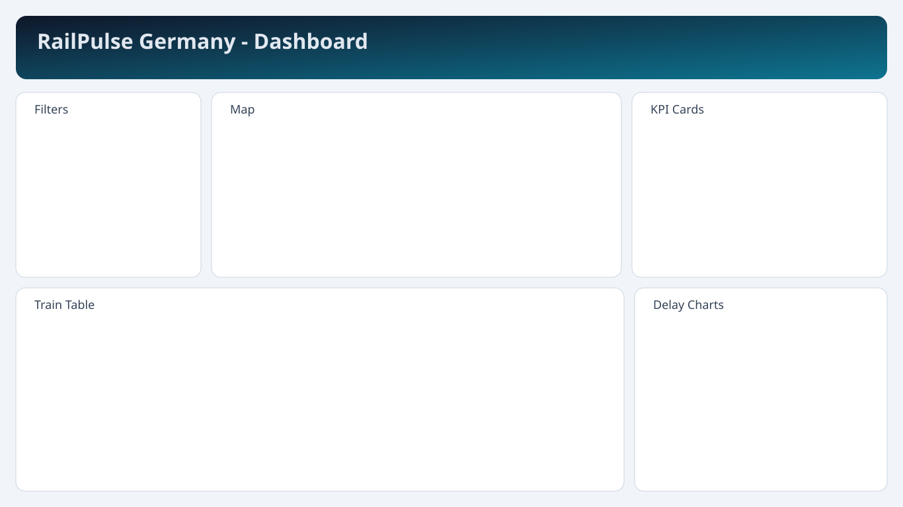
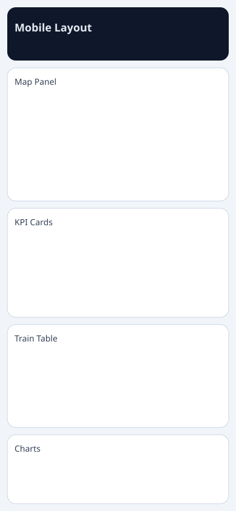

# RailPulse Germany - Train Delay Analytics Dashboard

React + Django tabanli tek sayfa bir Germany Train Delay Dashboard MVP'si.
Uygulama Deutsche Bahn Timetables API ve StaDa API ile secilen istasyonun kalkis/varis verilerini ceker, gecikme hesaplar, haritada gosterir, KPI ve grafik uretir.

## Screenshots

Desktop dashboard:



Mobile stack layout:



## Project Overview

- Varsayilan istasyon: `Muenchen Hbf` (EVA `8000261`)
- Station autocomplete: backend `GET /api/stations/search?q=`
- Board verisi: backend `GET /api/stations/:id/board`
- KPI metrikleri: backend `GET /api/stations/:id/stats`
- Grafik verisi: backend `GET /api/stations/:id/hourly-delay`
- Saglik kontrolu: `GET /api/health`

## Tech Stack

- Frontend: React + Vite + TypeScript + Tailwind CSS + Zustand + Axios + React Leaflet + Recharts
- Backend: Django + Django REST Framework + PostgreSQL (env ile) + requests
- Deployment target: Frontend Vercel, Backend Render

## Architecture

Monorepo yapisi:

- `frontend/`: dashboard SPA
- `backend/`: Django API + normalize DB modeli
- `backend/sample_data/`: backend fallback JSON dosyalari
- `frontend/public/fallback/`: frontend fallback JSON dosyalari
- `docs/screenshots/`: README ekran goruntuleri

Veri akisi:

1. Frontend yalnizca backend API endpoint'lerine istek atar.
2. Backend Timetables API ve StaDa API'ye gider.
3. Gelen veri normalize edilir, `TrainSnapshot` tablosuna upsert edilir.
4. `delay_minutes` backend'de hesaplanir (negatifse 0).
5. KPI ve chart endpoint'leri normalize veriden uretilir.

## Backend Data Model

- `Station`
- `TrainSnapshot`
- `DailyStationStats`

`TrainSnapshot` alanlari:

- station
- board_type
- train_name
- planned_time
- updated_time
- delay_minutes
- platform
- raw_payload
- record_uid (benzersiz anahtar)

## Setup Steps

## 1) Clone and enter repository

```bash
git clone <your-repo-url> railpulse-germany
cd railpulse-germany
```

## 2) Backend setup

```bash
cd backend
python -m venv .venv
.\.venv\Scripts\activate
pip install -r requirements.txt
copy .env.example .env
python manage.py migrate
python manage.py runserver
```

Backend varsayilan: `http://localhost:8000`

## 3) Frontend setup

```bash
cd ../frontend
npm install
copy .env.example .env
npm run dev
```

Frontend varsayilan: `http://localhost:5174`

## 4) Test commands

Backend:

```bash
cd backend
.\.venv\Scripts\python manage.py test
```

Frontend:

```bash
cd frontend
npm run test
npm run build
```

## Historical Trend Collection

Günlük/haftalık gecikme trendlerinin dolması için backend'in düzenli snapshot toplaması gerekir.
Bu komutu periyodik (örn. her 15 dakika) çalıştırabilirsiniz:

```bash
cd backend
.\.venv\Scripts\python manage.py collect_delay_snapshots --station-id 1 --board-type both --window-hours 4
```

Ulke genelinde hat bazli analiz icin once istasyon kataloğunu senkronlayin, sonra toplu snapshot alin:

```bash
cd backend
.\.venv\Scripts\python manage.py sync_stations_catalog --limit 10000
.\.venv\Scripts\python manage.py collect_delay_snapshots --all-stations --board-type both --window-hours 2 --station-limit 300 --skip-errors
```

## Environment Variables

Kokte `.env.example`, ayrica:

- `backend/.env.example`
- `frontend/.env.example`

Kritik degiskenler:

Backend:

- `DB_CLIENT_ID`
- `DB_API_KEY` (sadece backend)
- `DATABASE_URL`
- `DJANGO_CORS_ALLOWED_ORIGINS`
- `DEMO_USE_SAMPLE_DATA`
- `REFRESH_TTL_SECONDS` (dis API yenileme araligi, onerilen: 120)

Frontend:

- `VITE_API_BASE_URL`
- `VITE_USE_SAMPLE_DATA`

Gelistirme ortami icin onerilen frontend API ayari:

- `VITE_API_BASE_URL=/api` (Vite proxy ile `127.0.0.1:8000` backend'e yonlendirilir)

## License Notice

This dataset is provided under the Creative Commons Attribution 4.0 International license (CC BY 4.0).

If Deutsche Bahn (DB) data becomes part of the OpenStreetMap database, it is sufficient to credit Deutsche Bahn AG
in the contributors list. For downstream uses by database licensees, explicit DB attribution on every single use is
not required; indirect attribution (attribution to the database publisher that itself attributes DB) is sufficient.

## API Endpoints

- `GET /api/health`
- `GET /api/stations/search?q=`
- `GET /api/stations/:id/board?type=departure&window=2h&delay_threshold=all&category=`
- `GET /api/stations/:id/stats?type=departure&window=2h&delay_threshold=all&category=`
- `GET /api/stations/:id/hourly-delay?type=departure`
- `GET /api/stations/:id/delay-trends?type=departure&days=14`
- `GET /api/stations/:id/line-probabilities?type=departure&days=30&min_trains=6&top_n=8`
- `GET /api/lines/catalog?days=30&limit=200&q=`
- `GET /api/lines/rankings?days=14&min_trains=20&top_n=5`
- `GET /api/lines/:line_name/stats?days=30&top_stations=10`

Tum yanitlar JSON'dur.
Datetime alanlari ISO formatindadir.
Frontend alanlari: `planned_time_local`, `updated_time_local`, `delay_minutes`.
Olasilik alanlari: `delay_probability`, `delay_over_5_probability`, `delay_over_10_probability`, `delay_probability_confidence_95`.
Hat filtreleme: `board/stats/hourly-delay/delay-trends` endpointlerinde opsiyonel `line=<TRAIN_CODE>` query parami desteklenir.
Zaman penceresi: `window=1h|2h|4h|6h` kullanilabilir. `board/stats` endpoint'leri secili pencerede veri yoksa otomatik `6h` fallback dener ve `requested_window_hours` + `window_hours` alanlarini dondurur.

## Deployment Prep

- Render config: [`render.yaml`](./render.yaml)
- Backend Procfile: [`backend/Procfile`](./backend/Procfile)
- Vercel config: [`frontend/vercel.json`](./frontend/vercel.json)

## Known Limitations

- Deutsche Bahn API response formati ortama gore degisebilir; parser defensive ama tum edge-case'leri kapsamayabilir.
- Frontend station search iki panelde ayri input kullaniyor (istenen filtre kapsamini saglamak icin).
- Historical trend ve multi-station karsilastirma endpoint'leri bu MVP'de aktif degil.

## Future Improvements

- Historical trend analytics (gunluk/haftalik)
- Multi-station comparison
- Line-based performance analysis
- Disruption overlay (incident feeds)
- Delay heatmap visualization
- Background scheduler ile periodik snapshot ingestion
